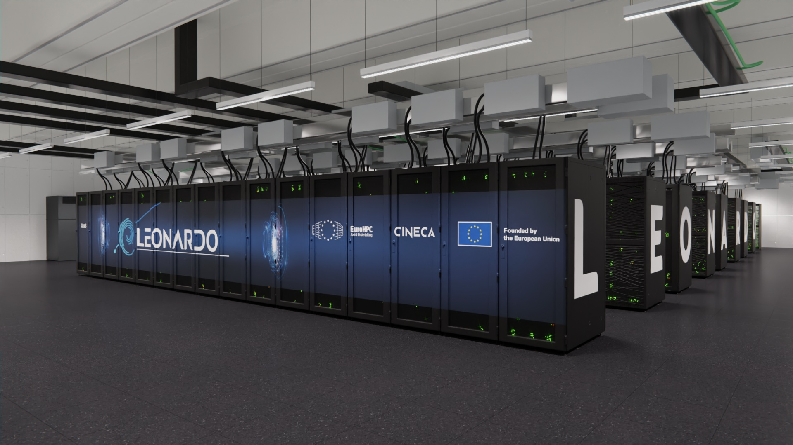

# About the work

  

  

In an era of rapid technological advancement and digitization of culture, our society is for the first time interacting daily with *Artificial Intelligence* systems. Such systems are being implemented in nearly every domain. However, the algorithms that are most significantly influencing our world are those that, for the first time, enable us to interact with computers using our natural language. These *Large Language Models*, as they are called, have thus eliminated the human-machine communication barrier, opening up new possibilities for the productivity of individuals and the production systems of large companies. In addition, they have parameterized all human knowledge, internalizing it within their billions of parameters.
Given their scale, these large models initially remained confined within the walls of the research labs of the largest tech companies. However, the open-source policy adopted by some of these companies has inevitably released these systems to the outside world, allowing their use and application to be democratized. Nowadays, therefore, understanding how to use such systems becomes vital for professionals in the field. 

In collaboration with **CINECA**, one of the most important technology research centers in Italy and Europe, this thesis aims to study in detail the functioning of Large Language Models in the field of Customer Support. Specifically, the goal of this work is to develop a system that can be used by the company for its own purposes in the continuous interaction with its customers of HPC systems, taking advantage of the release of Llama 3, the latest language model made by Meta. The work was made possible by the access provided by CINECA to the incredible computational resources of the **Leonardo** supercomputer, one of the best supercomputers in the world.

  

  

The structure of this thesis is therefore as follows. The first chapter will introduce Large Language Models and the Open-Source policy that allowed their democratization, and then introduce CINECA in more detail and better formalize the scope of this work. The second chapter will provide a more technical overview of the Transformers and Llama architecture. The third chapter will then discuss *fine-tuning*, and present the results of the model built with CINECA. Similarly, the fourth and fifth chapters will deal with *RAG* and *quantization*, and then show the results obtained in these areas.

# Use the code

The next few lines provide brief instructions for navigating the repository. I hope this code will be useful to anyone who wants to experiment with Llama 3 for building a custom chatbot.

First of all, you can install the dependencies by doing `pip install -r requirements.txt`

The `download_models` folder contains the two files we used to download Llama 3, and the other models (e.g., the embedding model used in RAG). It requires defining the HF access key as an environment variable.

The `dataset_and_anonymization` folder contains the files used to do email parsing and anonymization. This was necessary for the purpose of fine-tuning.

Thus, in the fine-tuning folder are the scripts for doing fine-tuning of Llama 3 on a dataset of multi-turn conversations.

In the `RAG` folder are the files to run RAG. Same for the `quantization` folder.

Finally, in the experiments folder are the codes to perform the experiments, the results of which are reported in the thesis.